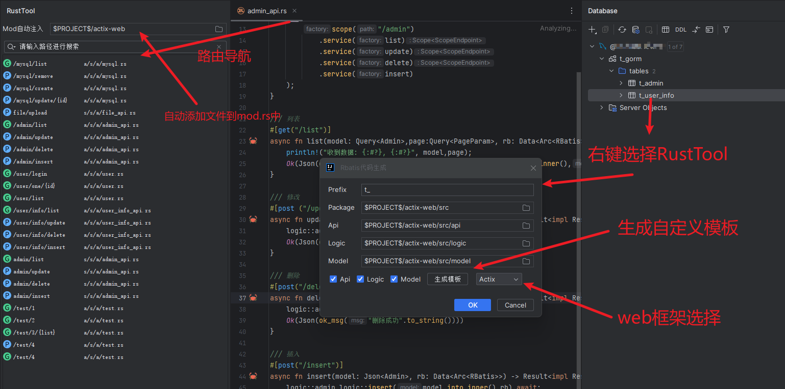
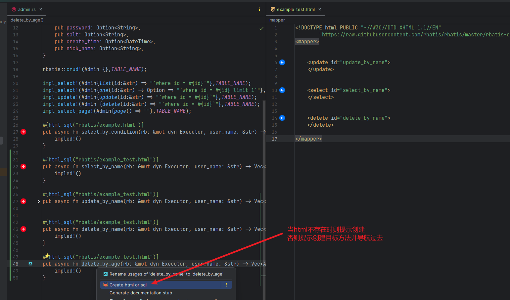
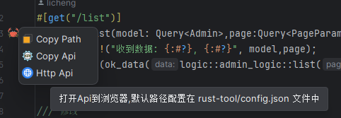
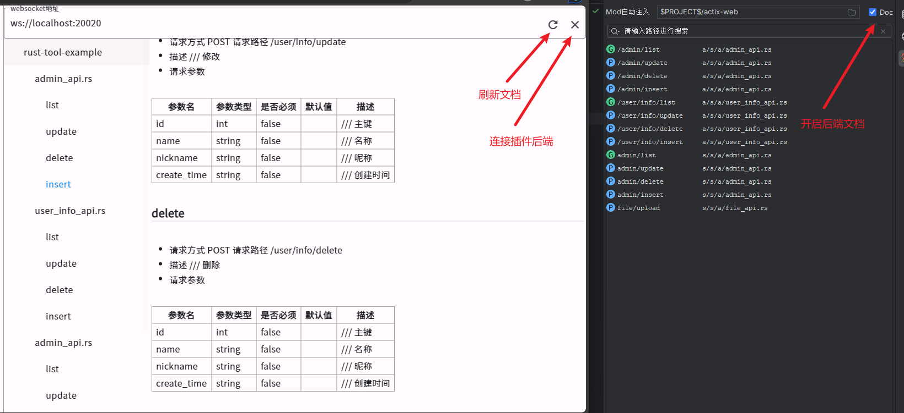

# RustTool

- [English](README_en.md)

## 描述

- 此项目是一个后台基本模板,使用 IDEA `RustTool` 插件来进行代码生成,
- 目前支持 `actix-web` 和 `salvo` 两个框架和 rbatis 增删改查代码生成.
- 你可以当作学习 `rust web` 项目的开发。 或者学习 `RustTool` 插件的使用。
- 插件下载地址: [RustTool](https://plugins.jetbrains.com/plugin/22428-rusttool)
- 注意: 如果在插件商店内搜索不到插件，`请更新你的开发工具(如IDEA)至最新版`。

## 入门

- 1.克隆项目
- 2.导入`t_gorm.sql` 到你的数据库
- 3.修改 `config.yml` 文件中的数据库链接
- 4.启动 `salvo-web/src/main.rs` 或 `actix-web/src/main.rs` 文件就可以运行项目了

## RustTool插件教程

- 插件介绍
- 项目中的 `rust-tool` 目录则是插件的所有配置
- 如果不想共享在其他电脑上，可以通过 `.gitignore` 文件排除
- 大致上来讲：`RustTool` 插件是一个代码生成工具。同时对于管理项目也起到了一定的帮助
- 例如: API导航，API文档导出，自动导入mod.rs等功能，或者复制前端请求代码。
- 这些功能虽然不是非必要的，但是能够提高开发效率。取决在于时间的取舍。

### 功能

- 🆗代表支持,❌暂不支持.

| 框架/插件                       | 功能                         | 支持) |
|-----------------------------|----------------------------|-----|
| actix-web / salvo +  rbatis | 路由导航                       | 🆗  |
| actix-web / salvo +  rbatis | 增删改查代码生成                   | 🆗  |
| actix-web / salvo           | Api文档导出                    | 🆗  |
| actix-web / salvo           | 从方法直接打开url到浏览器(2023.9.10+) | 🆗  |
| rust-tool                   | 创建目录时创建mod文件               | 🆗  |
| rust-tool                   | mod自动关联目录下新rs文件            | 🆗  |
| rust-tool                   | api共享功能(2023.9.11+)        | 🆗  |
| rust-tool                   | api请求测试功能(2023.9.18+)      | 🆗  |
| rust-tool                   | 前端请求代码(全栈开发)(2023.9.19+)   | 🆗  |
| rbatis                      | html和方法导航或创建               | 🆗  |
| rbatis                      | 方法上出现预览sql按钮               | 🆗  |
| rust-tool                   | SDK扩展                      | ❌   |

## 功能演示

### Api测试功能

- (2023.9.18+)版本
- 

### 自动导入mod.rs

- 你需要选中一个项目目录，在你mod.rs目录创建文件并修改时，会自动导入到mod.rs中。
- 由于idea的需要延迟刷新文件内容。你可能需要切换下 软件窗口 或 关闭文件再次打开。即可看到效果。
- 
- 1.需要通过Database工具窗口连接数据库
- 2.选中需要生成的表
- 3.选择生成的目录,进行生成代码

### 文档默认导出到项目根目录下的Api.md文件中

- 

### html和方法导航或创建

- 注意: html标签是根据方法前缀来识别创建相应的标签，如select_xx -> select标签,默认也是select标签。
- 

### 从方法直接打开url到浏览器

- 

### Api共享功能

- (2023.9.11+)版本
- 
- [https://licheng1013.github.io/toy-flutter/#/](https://licheng1013.github.io/toy-flutter/#/)

## 反馈

-
请通过issue反馈bug或者建议 [https://github.com/licheng1013/rust-tool-example/issues](https://github.com/licheng1013/rust-tool-example/issues)_
