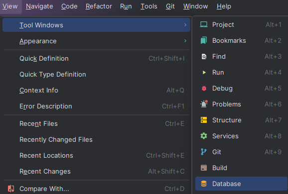
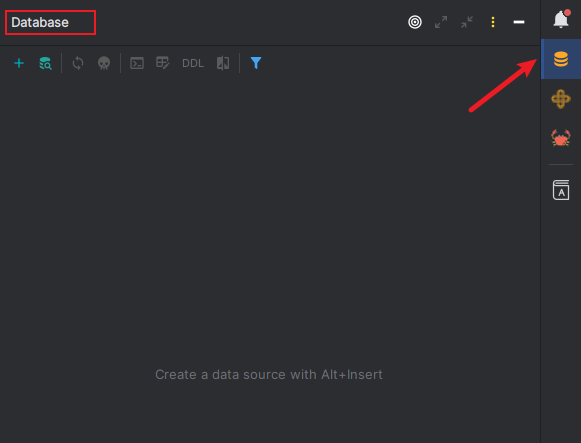

# RustTool

- [English](README_en.md)

## 开始

- 1: 安装 Jetbrains 插件 https://plugins.jetbrains.com/plugin/22428-rusttool
- 2: 导入t_gorm.sql到你的数据库并在 main.rs 文件修改为你的数据库链接
- 3: 运行 main.rs 文件
- 注意: 如果在插件商店内搜索不到插件，请更新你的开发工具(如IDEA)至最新版。

## 新手教程
- 1.可以先克隆此项目
- 2.导入t_gorm.sql到你的数据库并在 
- 3.找到 salvo-web / actix-web 项目下 main.rs 文件,修改数据库链接(启动项目则需要)
- 4.通过插件连接到数据库,
- 
- 
- 6.连接成功后,选中需要生成的表
- 7.右键即可看到生成代码的选项(RustTool)

## 介绍

- RustTool 是一个针对于 Rust web开发的一个idea插件，目前支持 actix-web 和 salvo 两个框架和 rbatis 增删改查代码生成.
- 🆗代表支持,❌暂不支持.

| 框架/插件                       | 功能                         | 支持) |
|-----------------------------|----------------------------|-----|
| actix-web / salvo +  rbatis | 路由导航                       | 🆗  |
| actix-web / salvo +  rbatis | 增删改查代码生成                   | 🆗  |
| actix-web / salvo           | Api文档导出                    | 🆗  |
| actix-web / salvo           | 从方法直接打开url到浏览器(2023.9.10+) | 🆗  |
| rust-tool                   | 创建目录时创建mod文件               | 🆗  |
| rust-tool                   | mod自动关联目录下新rs文件            | 🆗  |
| rust-tool                   | api共享功能(2023.9.11+)        | 🆗  |
| rust-tool                   | api请求测试功能(2023.9.18+)      | 🆗  |
| rbatis                      | html和方法导航或创建               | 🆗  |
| rbatis                      | 方法上出现预览sql按钮               | 🆗  |
| rust-tool                   | SDK扩展                      | ❌   |

## 功能演示

### Api测试功能

- (2023.9.18+)版本
- 

### 自动导入mod.rs

- 你需要选中一个项目目录，在你mod.rs目录创建文件并修改时，会自动导入到mod.rs中。
- 由于idea的需要延迟刷新文件内容。你可能需要切换下 软件窗口 或 关闭文件再次打开。即可看到效果。
- 
- 1.需要通过Database工具窗口连接数据库
- 2.选中需要生成的表
- 3.选择生成的目录,进行生成代码

### 文档默认导出到项目根目录下的Api.md文件中

- 

### html和方法导航或创建

- 注意: html标签是根据方法前缀来识别创建相应的标签，如select_xx -> select标签,默认也是select标签。
- 

### 从方法直接打开url到浏览器

- 

### Api共享功能
- (2023.9.11+)版本
- 
- [https://licheng1013.github.io/toy-flutter/#/](https://licheng1013.github.io/toy-flutter/#/)

## 反馈

- 请通过issue反馈bug或者建议 [https://github.com/licheng1013/rust-tool-example/issues](https://github.com/licheng1013/rust-tool-example/issues)
