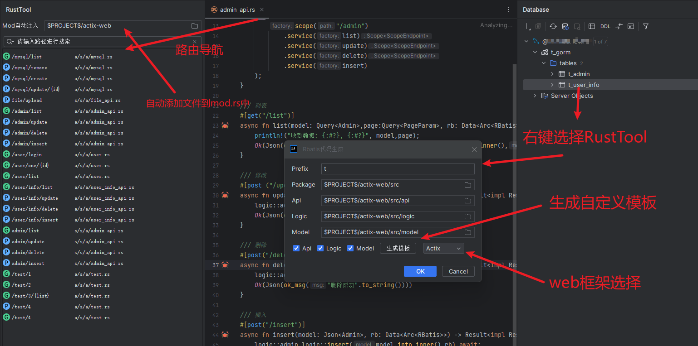

# RustTool

## start

- 1: Install Jetbrains plug-in https://plugins.jetbrains.com/plugin/22428-rusttool
- 2: Import t_gorm.sql into your database and modify the main.rs file to your database link
- 3: Run the main.rs file

## introduce

- RustTool is an idea plug-in for Rust web development. It currently supports actix-web and salvo frameworks and rbatis addition, deletion, modification, and code generation.
- y stands for support, n does not support it yet.

| Framework/Plug-in | Features | Support) |
|--------------------------------|-----------------|-----|
| actix-web/salvo + rbatis | routing navigation | y |
| actix-web / salvo + rbatis | Add, delete, modify and check code generation | y |
| actix-web/salvo | Api Document Export | y |
| rust-tool | Create mod files when creating a directory | y |
| rust-tool | mod automatically associates new rs files in the directory | y |
| rbatis | html and method navigation | n |
| rust-tool | SDK extension | n |

## Demo

- To automatically import mod.rs, you need to select a project directory. When you create a file in your mod.rs directory and modify it, it will be automatically imported into mod.rs.
- Due to the needs of the idea, the refresh of the file content is delayed. You may need to switch software windows or close the file and open it again. You can see the effect.

- 

## Feedback
- Please report bugs or suggestions through issue [https://github.com/licheng1013/rust-tool-example/issues](https://github.com/licheng1013/rust-tool-example/issues)