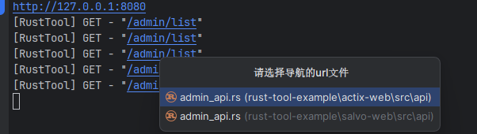

# 终端跳转接口

## 介绍

- 运行该项目的 `salvo-web`
- 要求打印的日志为: `[RustTool] GET - "/admin/list"` 才会触发跳转
- 其中: `RustTool` 可以自定义, 方法必须为 `GET,POST,DELETE,PUT` 请求路径必须`"/admin/list"`之间

- 示例如下

## 配置文件

- [config.json](../rust-tool/config.json)
- 字段为：`consoleKey` 如果没有请手动创建即可]()

## 演示

- 制作中