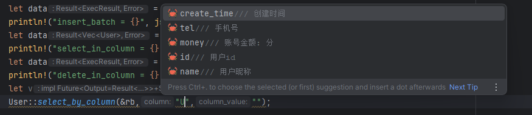
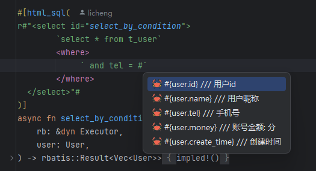
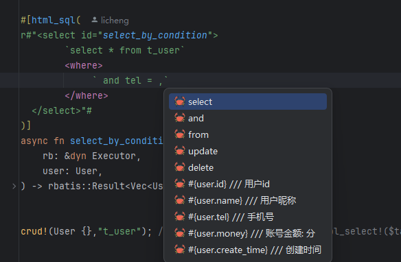

# Rbatis

## 官网
- https://github.com/rbatis/rbatis

## 介绍

- 支持暂时有限
- 注意: html标签是根据方法前缀来识别创建相应的标签，如select_xx -> select标签,默认也是select标签。
- 

## 字段提示

- 插件版本要求: `2024.1.3+`
- 
- 支持以下方法的类字段补全:
- "select_by_column", "delete_by_column", "update_by_column", "select_in_column", "delete_in_column"
- 使用方式: 输入 "" 后在中输入类名的开头如图上: "U" 即可触发补全

## html_sql宏对象提示

- 插件版本要求: `2024.1.3+`
- 目前只支持`,`和`#`触发提示
- 支持部分高亮
- `#`提示，只会提示对象
- 
- `,`提示，则会提示一些sql关键和对象属性
- 
