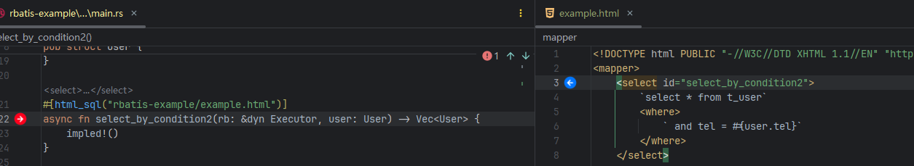
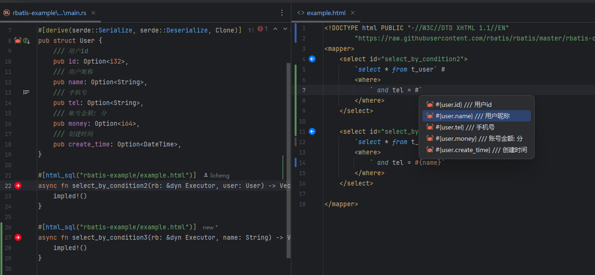

# Rbatis

## 官网

- https://github.com/rbatis/rbatis

## 介绍

- 支持暂时有限

## 字段提示

- 插件版本要求: `2024.1.3+`
- 
- 支持以下方法的类字段补全:
- "select_by_column", "delete_by_column", "update_by_column", "select_in_column", "delete_in_column"
- 使用方式: 输入 "" 后在中输入类名的开头如图上: "U" 即可触发补全

## html_sql

- 插件版本要求: `2024.1.3+`
- 目前只支持`,`和`#`触发提示
- 支持部分高亮
- `#`提示，只会提示对象参数和方法参数
- `,`提示，则会提示一些sql关键字和对象参数和方法参数

### 相互导航

- 插件版本要求: `忘了`
- 

### html文件中提示属性

- `#`提示示例
- 

### html_sql宏对象提示

- `#`提示示例
- 
- `,`提示示例
- 
